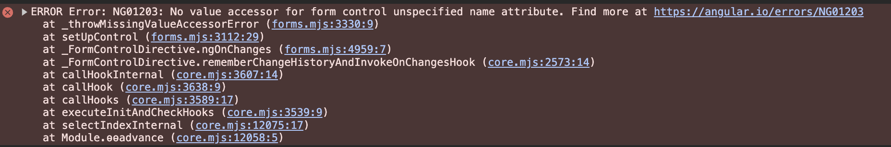

# ¿Te has preguntado cómo usar un componente Angular como si fuera un componente de formulario (<input />)?

Es posible que hayas creado un componente Angular y luego lo quieras usar como un componente de formulario, y te salga el siguiente error:



## Solución

Para transformar cualquier componente Angular en un componente de formulario, debes implementar el controlValueAccessor. A continuación, te enseñaré cómo.

### paso 1

En el decorador @Component, configuraremos el provider NG_VALUE_ACCESSOR para indicarle a Angular que el componente será un componente de formulario.

```typescript
import { Component, signal, forwardRef } from '@angular/core';
import { NG_VALUE_ACCESSOR } from '@angular/forms';

@Component({
  selector: 'app-circle',
  template: '<div class="circle" (click)="increase()">{{counter()}}</div>',
  styleUrl: './circle.component.scss',
  standalone: true,
  providers: [
    {
      provide: NG_VALUE_ACCESSOR,
      useExisting: forwardRef(() => CircleComponent),
      multi: true
    }
  ]
})
export class CircleComponent {
  ...
}
```

### paso 2

Implementaremos la interfaz ControlValueAccessor a la clase del componente.

```typescript
import { Component, signal, forwardRef } from '@angular/core';
import { NG_VALUE_ACCESSOR, ControlValueAccessor } from '@angular/forms';

@Component({
  selector: 'app-circle',
  template: '<div class="circle" (click)="increase()">{{counter()}}</div>',
  styleUrl: './circle.component.scss',
  standalone: true,
  providers: [
    {
      provide: NG_VALUE_ACCESSOR,
      useExisting: forwardRef(() => CircleComponent),
      multi: true
    }
  ]
})
export class CircleComponent implements ControlValueAccessor {
  counter = signal(0);
  onChange!: (counter: number) => void;
  onTouched!: () => void;
  disabled = false;

  increase() {
    this.counter.update(counter => counter + 1);
    this.onChange(this.counter());
  }

  writeValue(counter: number): void {
    console.log(1, counter);
    this.counter.set(counter);
  }

  registerOnChange(fn: (counter: number) => void): void {
    this.onChange = fn;
  }

  registerOnTouched(fn: () => void): void {
    this.onTouched = fn;
  }

  setDisabledState(disabled: boolean): void {
    this.disabled = disabled;
  }
}
```

* writeValue – Recibe el valor del form control en nuestro componente.

* registerOnChange – Nos provee la función necesaria para indicar al form control que el valor de nuestro componente ha cambiado.

* registerOnTouched – Nos provee la función necesaria para indicar al form control que el estado del componente ha cambiado.

* setDisabledState – Recibimos el valor del form control cada vez que se habilita o deshabilita en nuestro componente.

## Repositorio

[ejemplo github]()

## A continuación se presentará un video que explica lo escrito

[](https://youtu.be/EdXM46wv0hU)

